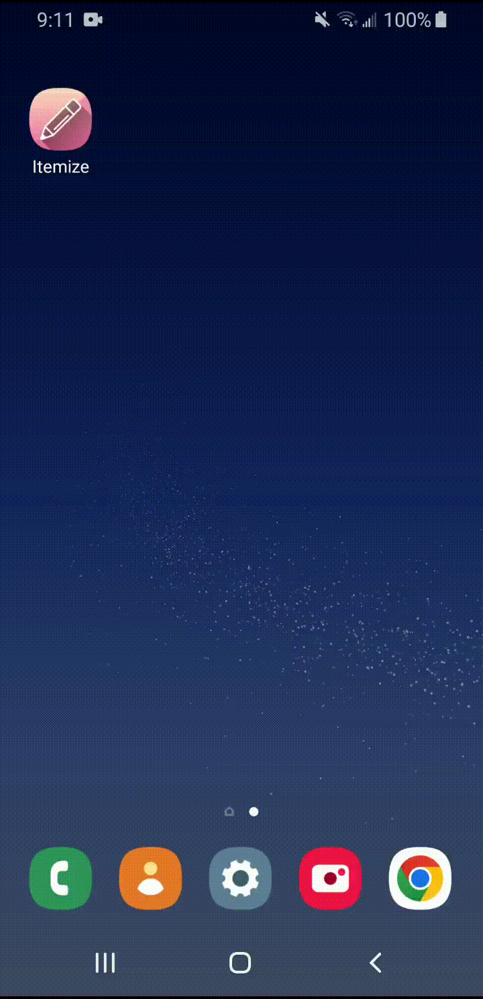

# Itemize
Itemize is a lightweight and user-friendly Android app designed to help you stay organized and manage your tasks efficiently. With its intuitive interface and features, it simplifies the process of creating, recording, and completing your daily tasks.

This app allows you to effortlessly add tasks by typing them into a text field. As you complete these tasks, the app allows you to mark them as done, which provides a satisfying sense of progress. Tasks marked as done can be quickly deleted, ensuring that you stay up to date when you access your to-do list from your Android smartphone, tablet, or any other compatible device.

In summary, Itemize is a comprehensive and efficient task management tool that helps you stay organized, prioritize effectively, and accomplish your goals with ease. Itemize was coded with Android Studio and written in Kotlin, and supports versions of Android 5.0 or higher.

## Appearance

## Adding Items

## Deleting Items

